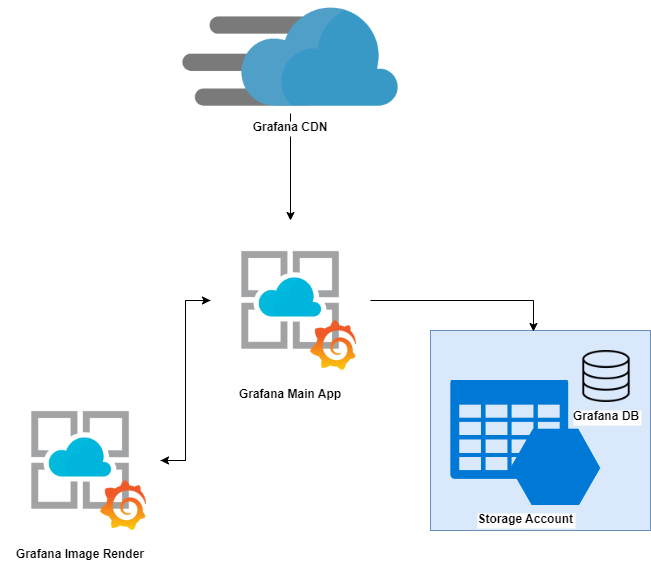

# About this module

This module will deploy an AppService running Grafana (pulled from docker hub) and creating it with system managed identity auth. Grafana version OSS.

This could be usefull if you want to have some control over Grafana without deploying the a full VM. Azure recently created a managed version of Grafana using PaaS [link here](https://azure.microsoft.com/en-us/services/managed-grafana/).

## Requirements

The agent from where you are running terraform needs powershell core installed. Also, you need to have rights to handle AD assignment for the RBAC and Managed Identity.

# Inputs

__prefix__ =  prefix to be used to name resources. [__string__] / __REQUIRED__

__azure_region__ = Region where resources will be created. [__string__] / __REQUIRED__

__app_settings__ = Map of settings to be included in the app. These can include runtime settings, secrets, keyvault references, ecc... [__map__] / __OPTIONAL__

__deploy_render__ = This will deploy an extra AppService to host the image render. [docs info](https://grafana.com/grafana/plugins/grafana-image-renderer/) [__bool__] / __OPTIONAL__

__deploy_cdn__ = Set to true to deploy an azure CDN on top of Grafana [__bool__] / __OPTIONAL__

__smtp_on__ = Set to true configure Grafana to use a SMTP Server to send emails. If you set this to true, you need to configure: smtp_host, smtp_password, smtp_user, smtp_from_address, smtp_from_name [__bool__] / __OPTIONAL__

__grafana_docker_version__ = Use a different Grafana Version. Default to 9.1.1 [__string__] / __OPTIONAL__

__image_render_docker_version__ = Use a different Image Render Version. Default to latest [__string__] / __OPTIONAL__

__grafana_plan_sku__ = SKU Plan for AppService  [info](https://azure.microsoft.com/en-us/pricing/details/app-service/windows/) [__string__] / __OPTIONAL__

__grafana_plan_size__ = SKU Size for AppService  [info](https://azure.microsoft.com/en-us/pricing/details/app-service/windows/) [__string__] / __OPTIONAL__

__image_render_plan_sku__ = SKU Plan for AppService  [info](https://azure.microsoft.com/en-us/pricing/details/app-service/windows/) [__string__] / __OPTIONAL__

__image_render_plan_size__ = SKU Size for AppService  [info](https://azure.microsoft.com/en-us/pricing/details/app-service/windows/) [__string__] / __OPTIONAL__
    
# Usage Example

__Classic: No Cdn and No Image Render__

```
module "deploy_grafana" {
  source              = "./grafana/"
  prefix              = "alef"
  azure_region        = "West Europe"
}

```
__CDN: Cdn and No Image Render__

```
module "deploy_grafana" {
  source              = "./grafana/"
  prefix              = "alef"
  azure_region        = "West Europe"
  deploy_cdn          = true
}

```
__Image Render: No Cdn and Image Render__

```
module "deploy_grafana" {
  source              = "./grafana/"
  prefix              = "alef"
  azure_region        = "West Europe"
  deploy_render       = true
}

```

__Full: Cdn and Image Render__

```
module "deploy_grafana" {
  source              = "./grafana/"
  prefix              = "alef"
  azure_region        = "West Europe"
  deploy_render       = true
  deploy_cdn          = true
}

```
__Full: Cdn and Image Render using SMTP__

```
module "deploy_grafana" {
  source              = "./grafana/"
  prefix              = "alef"
  azure_region        = "West Europe"
  deploy_render       = true
  deploy_cdn          = true
  smtp_on             = true
  smtp_host           = "smtp.sendgrid.net:587"
  smtp_password       = "*****"
  smtp_user           = "hello-there"
  smtp_from_address   = "myemail@email.com"
  smtp_from_name      = "email user"
}

```
**Any other Grafana setting can be set by using the variable app_settings. Grafana configs start with a "GF_" [docs here](https://grafana.com/docs/grafana/latest/setup-grafana/configure-grafana/)**

# Outputs

**This diagram is for the full setup only.**



# Reference

<https://registry.terraform.io/providers/hashicorp/azurerm/latest/docs/resources/app_service_plan>

<https://registry.terraform.io/providers/hashicorp/azurerm/latest/docs/resources/app_service>

<https://grafana.com/oss/>

<https://hub.docker.com/r/grafana/grafana>